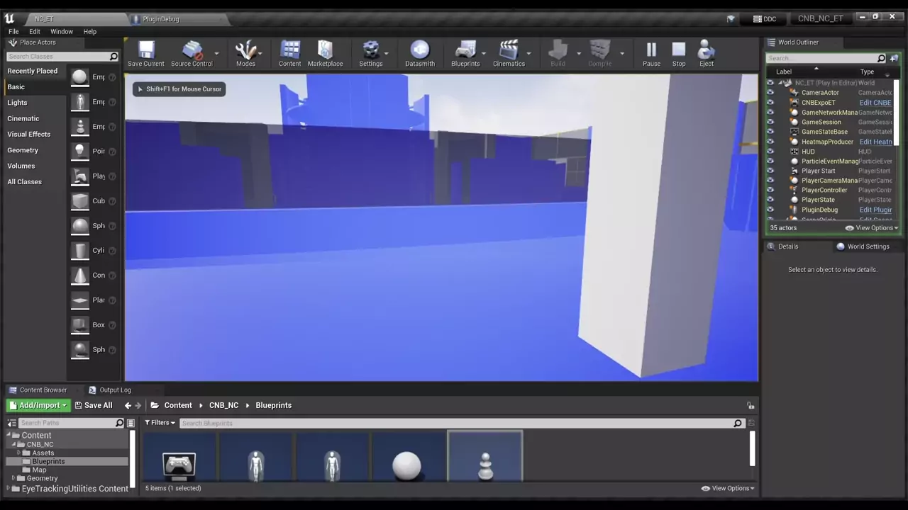

# Tracking of user’s view in virtual reality systems

## Czech Technical University in Prague

## Faculty of Information Technology

Department of Software Engineering

## © 2022 Richard Kvasnica 

## Assignment:
Eye-tracking is a feature of many modern virtual reality systems. It enables determination of user's gaze by combining head rotation and eye movement inside a 3D virtual environment. In VR, this tracking has applications in graphics performance optimization and is used for "view frustum culling". The aim of this work is to utilize this feature for user behaviour analysis in a predefined 3D scene in virtual reality.

1. Research available eye-tracking systems and explore current gaze tracking solutions.
2. Describe the architecture and principles of the found eye-tracking methods. Mainly 
focus on those implemented in virtual reality systems.
3. Choose a VR system with eye-tracking capabilities accessible to you, and develop an 
app prototype that collects gaze data in a virtual 3D scene.
4. Use the app to obtain data from different users. Attempt to describe and visualize the 
resultant data.
5. Submit your work with images and commented source code attached.

## Abstract

The purpose of this thesis is to explore the possibilities of eye tracking inside headsets for virtual reality, to analyse existing solutions, to create a prototype application that collects and visualises gaze data, and use it to create an experiment that collects the data from multiple users. The collected data are used to make resultant data that are analysed. A plug-in for Unreal Engine 4 (UE4) is the form selected for the prototype application. To visualise the gaze data, heatmaps are generated for each object in the scene. This thesis describes the design of the plug-in, its implementation and its use to create an experiment of a traversal through a scene of the Czech National Bank Visitor Centre. The scene is in Blender, and the thesis describes the necessary modifications needed for a successful export to UE4 to achieve the correct functionality of the experiment. The result of this thesis is a working prototype of a plug-in for UE4, capable of collecting gaze data to produce heatmaps in real-time, that is not dependent on any eye-tracking hardware. It also offers a description of the use of XTAL, which was not possible to make operational to collect gaze data due to the instability of its OpenXR runtime. There was no other alternative, so the forward vectors of a virtual camera in the Unreal Engine project scene were used to collect data from different users. Finally, the thesis describes the processing and evaluation of the data collected. The plug-in, the Unreal Engine project with the experiment and the data are available in the enclosed media DVD.

### Keywords

`virtual reality`, `eye tracking`, `heatmap`, `Unreal Engine`, `plug-in`, `XTAL`